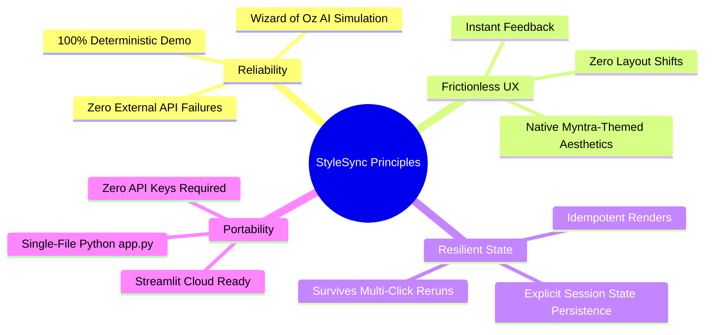
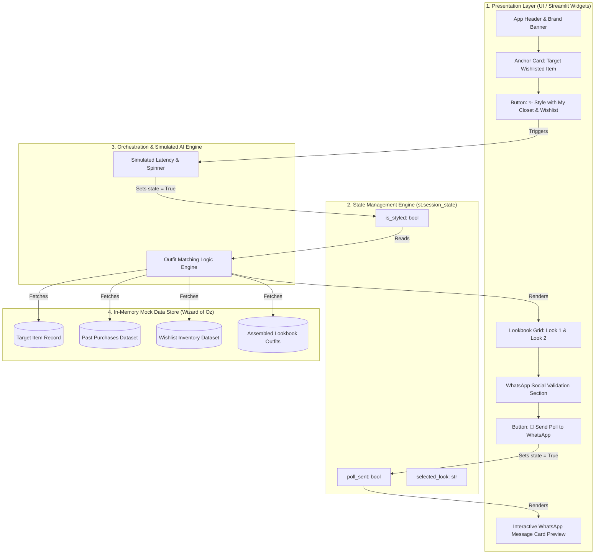
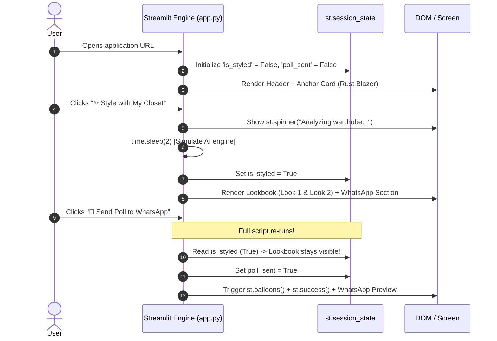
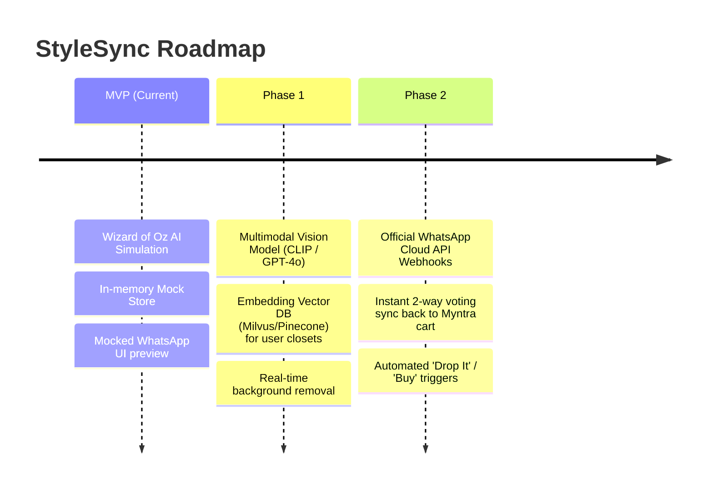

# Technical Architecture Document: Myntra "StyleSync" MVP

**System:** AI-Powered Smart Closet & Social Validation System  
**Deliverable:** High-Fidelity "Wizard of Oz" Interactive Prototype  
**Target Platform:** Single-File Streamlit Application (`app.py`)  

---

## 1. Executive Summary & Problem Context

In modern fashion e-commerce platforms like Myntra, consumers frequently experience two distinct high-friction drop-off points:
1. **"Styling Paralysis"**: Users wishlist items they find aesthetically pleasing, but hesitate to complete the purchase because they are uncertain how the item pairs with garments they already own.
2. **"Off-Platform Leakage"**: To resolve styling doubts, users take screenshots and export product links to messaging apps (like WhatsApp) to consult friends. This breaks the purchasing funnel, causing high abandonment and delayed conversion.

**"StyleSync"** addresses both bottlenecks directly in the product experience:
- **Intelligent Wardrobe Matching:** Visually orchestrates complete modular outfits (Rule of 3) pairing the wishlisted item with past purchases and catalog accessories.
- **Psychological Confidence Badging:** Reinforces existing ownership (`✅ In your closet`) and clear wishlist pairing badges.
- **Native Social Validation Loop:** Embeds an in-app WhatsApp polling mechanism ("Buy or Drop") to maintain session momentum.

---

## 2. Architectural Principles & Constraints



### Key Constraints:
- **"Wizard of Oz" AI Pattern:** The system uses realistic simulated latency (`time.sleep`) and deterministic mock schemas rather than live LLM endpoints (e.g. OpenAI/Claude) to guarantee zero latency failures, zero API outages, and zero token costs during stakeholder presentations.
- **Single-Script Architecture:** The entire UI and state machine must reside in a single `app.py` script for friction-free deployment to Streamlit Community Cloud.
- **Zero External Media Dependency:** Avoid fragile external image URLs by utilizing stylized CSS containers, unicode iconography, and structured typography.

---

## 3. System Architecture & Component Hierarchy

The system follows a multi-tier logical separation implemented cleanly within a single Streamlit runtime:



---

## 4. Logical Component Breakdown

| Layer | Component | Technical Mechanism | Responsibility |
| :--- | :--- | :--- | :--- |
| **Mock Store** | `Data Store` | In-memory Python Data Structures | Provides static, validated payloads representing target items, historical purchase ledger, and catalog items. |
| **Presentation** | `Header & Brand` | `st.title`, `st.markdown`, `st.divider` | Sets high-trust e-commerce aesthetic with Myntra-inspired palette. |
| **Presentation** | `Anchor Card` | `st.container`, `st.metric`/custom styled cards | Highlights the isolated item causing the user's styling hesitation. |
| **Orchestrator** | `AI Simulator` | `st.spinner`, `time.sleep(2)` | Simulates vector embedding query and wardrobe clustering time to create anticipation. |
| **State** | `State Engine` | `st.session_state` keys (`is_styled`, `poll_sent`) | Maintains lookbook and social loop state across Streamlit execution runs. |
| **Presentation** | `Lookbook Grid` | `st.columns(2)`, badges, markdown cards | Displays "Rule of 3" outfits (Smart Casual Office vs. Weekend Brunch). |
| **Social Loop** | `WhatsApp Poll` | `st.button`, `st.balloons()`, `st.expander` | Renders poll trigger, micro-animations, and social card preview. |

---

## 5. State Machine & Execution Lifecycle

Streamlit executes the entire script top-to-bottom on every user interaction. Without deliberate state management, interacting with a secondary widget (e.g., clicking *"Send Poll"*) re-executes the file and resets dynamic sections.



### State Variables Schema

```python
# Session State Registry
SESSION_STATE_DEFAULTS = {
    "is_styled": False,      # Controls Lookbook and Social Loop visibility
    "poll_sent": False,      # Controls WhatsApp poll dispatch and success preview
    "active_look": "Look 1"  # Tracks which outfit is highlighted for the poll
}
```

---

## 6. Dummy Data Architecture & Schemas

### 6.1. Target Item Schema
```python
target_item: dict[str, str] = {
    "id": "ITEM-9081",
    "name": "Rust Linen Relaxed-Fit Blazer",
    "brand": "Roadster / Myntra Studio",
    "price": "₹3,499",
    "original_price": "₹4,999",
    "discount": "30% OFF",
    "status": "Added 5 days ago",
    "category": "Outerwear / Blazers",
    "icon": "🧥"
}
```

### 6.2. Historical Purchases Schema (Closet Inventory)
```python
past_purchases: list[dict[str, str]] = [
    {
        "id": "PURCH-2026-01",
        "name": "Classic White Crewneck Tee",
        "category": "Topwear",
        "badge": "✅ In your closet (Purchased on Myntra)",
        "badge_type": "owned_myntra",
        "icon": "👕"
    },
    {
        "id": "OFFLINE-2026-02",
        "name": "Olive Linen Shirt",
        "category": "Topwear",
        "badge": "📸 Offline Closet (Uploaded from Camera Roll)",
        "badge_type": "owned_offline",
        "icon": "👔"
    }
]
```

### 6.3. Wishlist & Recommended Pairing Schema
```python
wishlist_inventory: list[dict[str, str]] = [
    {
        "id": "WISH-304",
        "name": "Gold Minimalist Watch",
        "category": "Accessories",
        "badge": "💛 From your Wishlist",
        "badge_type": "wishlist",
        "icon": "⌚"
    },
    {
        "id": "REC-512",
        "name": "Light Wash Wide-Leg Denim",
        "category": "Bottomwear",
        "badge": "💡 Suggested Pairing - ₹1,899",
        "badge_type": "suggested",
        "icon": "👖"
    }
]
```

### 6.4. Assembled Lookbook Structure
```python
outfits = [
    {
        "look_id": "look_1",
        "title": "Look 1: Smart Casual Office",
        "vibe": "Professional, clean & effortless",
        "items": [
            {"role": "Layer (Target)", "name": "Rust Linen Blazer", "tag": "🎯 Target Item", "icon": "🧥"},
            {"role": "Base Top", "name": "Classic White Crewneck Tee", "tag": "✅ In your closet", "icon": "👕"},
            {"role": "Bottoms", "name": "High-Waisted Black Trousers", "tag": "✅ In your closet", "icon": "👖"}
        ],
        "ownership_ratio": "2/3 Items Already Owned"
    },
    {
        "look_id": "look_2",
        "title": "Look 2: Weekend Brunch & Social",
        "vibe": "Relaxed, warm & contemporary",
        "items": [
            {"role": "Layer (Target)", "name": "Rust Linen Blazer", "tag": "🎯 Target Item", "icon": "🧥"},
            {"role": "Base Top", "name": "White Ribbed Tank Top", "tag": "💡 Suggested Pairing", "icon": "🎽"},
            {"role": "Bottoms", "name": "Light Wash Wide-Leg Denim", "tag": "💡 Suggested Pairing", "icon": "👖"},
            {"role": "Accessory", "name": "Gold Minimalist Watch", "tag": "💛 From your Wishlist", "icon": "⌚"}
        ],
        "ownership_ratio": "1 Wishlist + 2 New Additions"
    }
]
```

---

## 7. UI/UX Specification & Psychological Design

### Visual Hierarchy & Confidence Anchoring

```
+-------------------------------------------------------------------+
|  🛍️ MYNTRA STYLESYNC                                              |
|  AI Wardrobe Companion                                            |
+-------------------------------------------------------------------+
|  [TARGET ITEM CARD]                                               |
|  🧥 Rust Linen Relaxed-Fit Blazer | ₹3,499 (30% OFF)              |
|  Status: 📌 Added to Wishlist 5 days ago                          |
|                                                                   |
|  [ ✨ Style with My Closet & Wishlist ]  <-- PRIMARY ACTION       |
+-------------------------------------------------------------------+
                                 │
                   (User Click -> Spinner 2.0s)
                                 ▼
+-------------------------------------------------------------------+
|  🎉 We found 2 complete outfits using items you already own!       |
|                                                                   |
|  +-----------------------------+  +-----------------------------+ |
|  | Look 1: Smart Casual Office |  | Look 2: Weekend Brunch      | |
|  | --------------------------- |  | --------------------------- | |
|  | 🧥 Rust Linen Blazer (Target)|  | 🧥 Rust Linen Blazer (Target)| |
|  | 👕 White Tee [✅ In Closet] |  | 🎽 Ribbed Tank [💡 Suggest] | |
|  | 👖 Black Pants [✅ In Closet]|  | 👖 Light Denim [💡 Suggest] | |
|  |                             |  | ⌚ Gold Watch [💛 Wishlist] | |
|  | [✅ 2 of 3 Items in Closet] |  | [🔥 High Social Match]      | |
|  +-----------------------------+  +-----------------------------+ |
+-------------------------------------------------------------------+
|  Can't decide? Ask your circle!                                    |
|  [ 💬 Send Poll to WhatsApp ]          <-- SOCIAL LOOP CTA        |
+-------------------------------------------------------------------+
                                 │
                   (User Click -> Balloons 🎉)
                                 ▼
+-------------------------------------------------------------------+
|  ✅ Poll dispatched to WhatsApp!                                   |
|  ┌──────────────────────────────────────────────────────────────┐ |
|  │ 📱 WhatsApp Poll Card Preview                                │ |
|  │ "Help me choose my outfit!                                   │ |
|  │  Option 1: Smart Casual Office (Rust Blazer + Black Trousers)│ |
|  │  Option 2: Weekend Brunch (Rust Blazer + Light Denim)        │ |
|  │  [ 🔘 Vote Look 1 ]   [ 🔘 Vote Look 2 ]   [ 🔘 Drop It ]"   │ |
|  └──────────────────────────────────────────────────────────────┘ |
+-------------------------------------------------------------------+
```

### Psychological Triggers Implemented:
1. **Endowment Effect / Sunk Cost Validation (`✅ In your closet`):** Reduces perceived purchase risk by showing that ₹3,499 completes multiple pre-existing outfits.
2. **Catalog Upselling without Friction (`💛 From your Wishlist`, `💡 Suggested Pairing`):** Surfaces cross-category items naturally within contextual looks.
3. **Social Reassurance (`💬 WhatsApp Poll`):** Offloads micro-decision friction to peer networks without losing user attention to external apps.

---

## 8. Non-Functional & Operational Requirements

### 8.1. Performance & Latency
- Startup load time: `< 500ms` (pure in-memory).
- Simulated AI Processing latency: `2.0s` (calibrated to mimic heavy neural network computation for perceived value).
- Re-render latency upon secondary clicks: `< 100ms`.

### 8.2. Maintainability & Code Cleanliness
- **PEP8 Compliance:** Modular functions (`render_header()`, `render_anchor()`, `render_lookbook()`, `render_social_loop()`).
- **Inline Documentation:** Detailed comments specifically detailing the `st.session_state` lifecycle for seamless demonstration to stakeholders.

### 8.3. Portability & Dependencies
- Core Language: `Python >= 3.9`
- External Packages: `streamlit`
- Built-in Libraries: `time`, `dataclasses` / `typing`

---

## 9. Future Evolution: Production Roadmap


