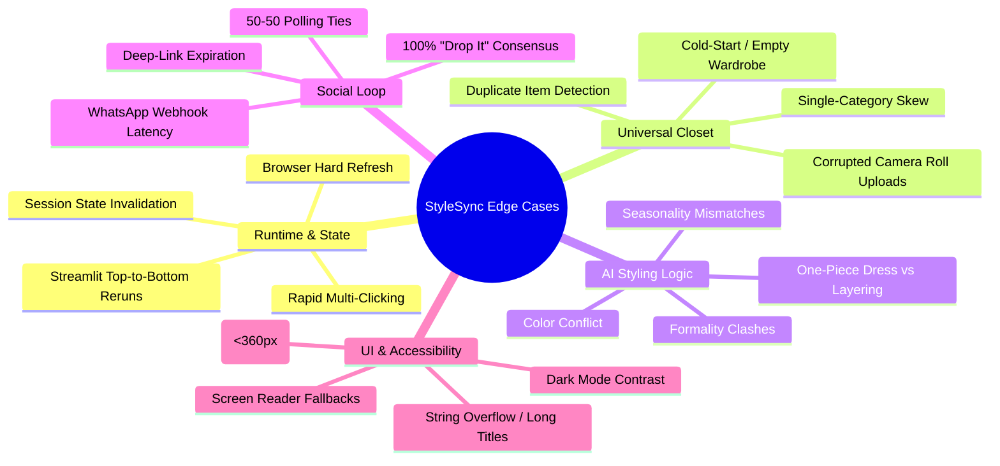
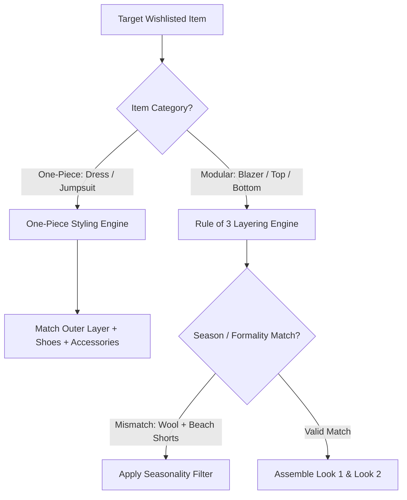

# Edge Case Analysis & Mitigation Guide: Myntra "StyleSync"

**System:** AI-Powered Smart Closet & Social Validation System  
**Prototype Scope:** Single-File Streamlit MVP (`app.py`) & Production Evolution  
**References:** [problemstatement.md](file:///c:/Users/DELL/OneDrive/Desktop/kartikey/myntra%20mvp/problemstatement.md), [architecture.md](file:///c:/Users/DELL/OneDrive/Desktop/kartikey/myntra%20mvp/architecture.md), [implementationplan.md](file:///c:/Users/DELL/OneDrive/Desktop/kartikey/myntra%20mvp/implementationplan.md)

---

## Table of Contents

1. [Executive Taxonomy of Edge Cases](#1-executive-taxonomy-of-edge-cases)
2. [State & Streamlit Lifecycle Edge Cases](#2-state--streamlit-lifecycle-edge-cases)
3. [Wardrobe & Universal Closet Data Edge Cases](#3-wardrobe--universal-closet-data-edge-cases)
4. [Lookbook & AI Styling Heuristics Edge Cases](#4-lookbook--ai-styling-heuristics-edge-cases)
5. [WhatsApp Social Loop & Voting Edge Cases](#5-whatsapp-social-loop--voting-edge-cases)
6. [UI/UX, Responsiveness & Accessibility Edge Cases](#6-uiux-responsiveness--accessibility-edge-cases)
7. [Comprehensive Edge Case Mitigation Matrix](#7-comprehensive-edge-case-mitigation-matrix)

---

## 1. Executive Taxonomy of Edge Cases



---

## 2. State & Streamlit Lifecycle Edge Cases

### 2.1. Rapid Multi-Clicking on Primary CTA
* **Scenario:** The user rapidly clicks `"✨ Style with My Closet & Wishlist"` multiple times while the 2-second spinner is active.
* **Risk:** Multiple asynchronous re-runs queued, causing UI flickering or repeated execution of the simulated AI latency.
* **MVP Mitigation:** The button triggers `st.spinner()` synchronously, immediately elevation of `st.session_state.is_styled = True`, followed by an explicit `st.rerun()`. Subsequent clicks find `is_styled == True` and bypass the spinner.
* **Production Architecture:** Frontend button debouncing + idempotency token generated per session.

### 2.2. Secondary Action Script Reset ("Send Poll to WhatsApp")
* **Scenario:** User generates outfits, scrolls down, and clicks `"💬 Send Poll to WhatsApp"`.
* **Risk:** Streamlit's native execution model re-executes the file from line 1. If Lookbook rendering relies on local function variables rather than `st.session_state`, the Lookbook disappears.
* **MVP Mitigation:** Explicit conditional guards wrapped around `st.session_state.is_styled`:
  ```python
  if st.session_state.is_styled:
      render_lookbook()
      render_social_loop()
  ```
* **Verification:** Validated that clicking the WhatsApp button updates `st.session_state.poll_sent = True` while retaining `is_styled = True`.

### 2.3. Full Browser Page Refresh (Hard Reload / `F5`)
* **Scenario:** User hard refreshes their browser tab mid-session.
* **Risk:** Streamlit in-memory `session_state` resets to defaults (`is_styled = False`).
* **MVP Mitigation:** Handled gracefully by re-rendering the initial Wishlist Anchor View cleanly with zero console crashes or broken DOM elements.
* **Production Architecture:** Persist active lookbook IDs in LocalStorage / Redis session cache keyed by `user_id`.

---

## 3. Wardrobe & Universal Closet Data Edge Cases

### 3.1. The "Cold-Start" User (Zero Historical Purchases & Zero Uploads)
* **Scenario:** A brand-new user wishlists an item but has no purchase history on Myntra and has uploaded 0 camera roll items.
* **Failure Mode:** AI cannot find `✅ In your closet` items to complete the "Rule of 3" modular outfit.
* **Mitigation Strategy:**
  1. Detect `len(past_purchases) == 0`.
  2. Dynamically fall back to **"Curated Starter Wardrobe"** or **"Catalog Essentials"** (e.g., standard white tee, classic blue denim).
  3. Replace badge `✅ In your closet` with `💡 Wardrobe Essential Recommendation` and present a 1-tap `"Add all essentials to cart"` bundle discount.
  4. Display a gentle prompt: *"Upload 1 photo from your camera roll to unlock personalized closet matching."*

### 3.2. Single-Category Skew (e.g., User Only Owns Shoes/Footwear)
* **Scenario:** The user's historical closet data contains only sneakers and boots, but the target item is a blazer requiring base tops and trousers.
* **Mitigation Strategy:**
  - AI matching algorithm assigns priority slots: `Layer (Target)` $\rightarrow$ `Base Top` $\rightarrow$ `Bottoms`.
  - Missing slots automatically pull from the user's `wishlist_inventory` or top-rated catalog pairings, clearly tagged as `💡 Suggested Pairing`.

### 3.3. Corrupted or Non-Garment Camera Roll Uploads (Universal Closet Moat)
* **Scenario:** User uploads a photo of their pet, a receipt, or an extremely blurry photo under the "Offline Closet" camera roll upload.
* **Mitigation Strategy:**
  - **Phase 1 Vision AI Guardrail:** Run lightweight YOLO / CLIP garment-detection filter.
  - If confidence $<0.70$, return user-friendly validation error: *"We couldn't detect clothing in this photo. Please upload a clear photo of a garment on a flat surface or hanger."*
  - In MVP prototype: Data is strictly validated and typed via Python schemas.

### 3.4. Duplicate Garment Detection (Cross-Channel Redundancy)
* **Scenario:** User purchased a black blazer on Myntra 3 months ago and is now wishlisting a nearly identical black blazer.
* **Mitigation Strategy:**
  - Introduce a **"Wardrobe Redundancy Alert"**:
    `⚠️ You already own a similar item: 'Roadster Black Slim Blazer' (Purchased Oct 2025). Did you want to style that instead?`
  - Prevents buyer remorse and builds deep consumer trust.

---

## 4. Lookbook & AI Styling Heuristics Edge Cases



### 4.1. The One-Piece Garment Case (Dresses, Jumpsuits, Dungarees)
* **Scenario:** The target wishlisted item is a maxi dress or jumpsuit. Applying the "Top + Bottom + Layer" Rule of 3 would create invalid combinations (e.g. putting jeans under a formal evening dress).
* **Mitigation Strategy:**
  - Detect `category == "One-Piece"`.
  - Switch styling layout to **"Anchor + Accents"**:
    - `Primary Piece:` Target Maxi Dress
    - `Layer:` Cropped Denim Jacket / Shrug (`✅ In your closet`)
    - `Footwear / Bag:` Leather Strappy Sandals (`💛 From your Wishlist`)
    - `Jewelry:` Gold Hoops (`💡 Suggested Pairing`)

### 4.2. Seasonality & Formality Incompatibility
* **Scenario:** Target item is a heavy winter trench coat, but past purchases only contain summer linen shorts and flip-flops.
* **Mitigation Strategy:**
  - Outfit generator tags every item with `formality_score` (1-5) and `season_tag` (Summer, Winter, Monsoon, All-Weather).
  - Outfits reject combinations where $|\text{formality}_A - \text{formality}_B| > 2$ or seasons directly clash.

---

## 5. WhatsApp Social Loop & Voting Edge Cases

### 5.1. The 50-50 Polling Tie
* **Scenario:** User shares the poll with 4 friends; 2 vote for *Look 1* and 2 vote for *Look 2*.
* **Mitigation Strategy:**
  - Render an intelligent tie-breaker banner:
    `⚖️ It's a dead heat! Both looks scored 50%. Since Look 1 uses 2 items already in your closet, it saves you ₹2,698!`
  - Nudges the user towards the higher-ownership / lower-cost alternative.

### 5.2. Unanimous "Drop It" Consensus
* **Scenario:** Friends vote 100% to *"Drop It"* (rejecting the purchase).
* **Psychological Risk:** User experiences disappointment and may abandon the session entirely.
* **Mitigation Strategy:**
  - Turn a negative outcome into an upsell opportunity:
    `💡 Your circle suggested skipping this blazer. Based on your closet, here are 2 alternative silhouettes your friends will love:`
  - Displays 2 curated alternative wishlisted items matching the user's existing pants and tees.

### 5.3. Delayed WhatsApp Responses / Asynchronous Engagement
* **Scenario:** The user triggers the WhatsApp poll, but friends take 4 hours to vote.
* **Mitigation Strategy:**
  - Native in-app badge: *"⏳ Poll active (2 votes received)"*.
  - Push notification triggered when the poll reaches quorum (e.g., 3+ votes): *"Your friends voted! Look 1 is the winner with 75% approval."*

---

## 6. UI/UX, Responsiveness & Accessibility Edge Cases

### 6.1. Mobile Screen Squeeze ($<360\text{px}$ Viewports)
* **Scenario:** User opens the application on an ultra-compact smartphone (e.g. iPhone SE / Galaxy Z Flip cover screen).
* **Risk:** 2-column lookbook layout squishes text, causing unsightly word-breaks in badges.
* **Mitigation Strategy:**
  - Clean flexbox / Streamlit column collapse rules.
  - Badges use `display: inline-block`, `white-space: normal`, and compact font sizing (`0.76rem`).

### 6.2. Extreme String Lengths / Product Title Overflow
* **Scenario:** Third-party brand item has a 90-character title (e.g., *"Roadster Men Rust Orange Pure Linen Solid Casual Relaxed-Fit Lightweight Summer Single-Breasted Blazer"*).
* **Mitigation Strategy:**
  - CSS ellipsis truncation on header titles with full name displayed in native tooltip:
    ```css
    .product-title {
        white-space: nowrap;
        overflow: hidden;
        text-overflow: ellipsis;
        max-width: 100%;
    }
    ```

### 6.3. Dark Mode / Light Mode Theme Inconsistencies
* **Scenario:** User has their OS or Streamlit environment set to Dark Mode.
* **Risk:** Hardcoded dark text on dark backgrounds or white cards clashing with dark canvases.
* **Mitigation Strategy:**
  - Custom CSS uses explicit foreground and background color declarations on all card containers (`#FFFFFF` background paired with `#282C3F` text) ensuring uniform contrast regardless of host theme.

---

## 7. Comprehensive Edge Case Mitigation Matrix

| # | Edge Case Domain | Specific Scenario | Severity | Prototype Mitigation | Production Mitigation |
| :-: | :--- | :--- | :-: | :--- | :--- |
| **1** | **State Machine** | Secondary button click ("Send Poll") | 🔴 High | State protected via `st.session_state.is_styled` | Persistent session store (Redis) |
| **2** | **State Machine** | Rapid double-clicking on CTA | 🟡 Medium | Synchronous spinner execution + immediate lock | Debounced frontend button handlers |
| **3** | **Universal Closet** | Cold-Start (0 purchases / 0 uploads) | 🔴 High | Fallback to classic wardrobe essentials | Onboarding camera-roll upload flow |
| **4** | **Universal Closet** | Corrupted / Blurry photo upload | 🟡 Medium | Typed dummy data schema | YOLOv8 / CLIP garment classifier |
| **5** | **Universal Closet** | Duplicate garment already owned | 🟢 Low | Visualized distinct ownership badges | Semantic similarity image deduplication |
| **6** | **AI Styling** | One-Piece dress / Jumpsuit | 🟡 Medium | Custom Look 2 layout with accessory pairing | Category-aware Rule-of-3 branching |
| **7** | **AI Styling** | Formality / Season clash | 🟡 Medium | Curated harmonious Lookbook sets | Formality & weather scoring matrix |
| **8** | **Social Loop** | 50/50 polling tie among friends | 🟢 Low | Clean preview card showing both options | Algorithmic tie-breaker nudge |
| **9** | **Social Loop** | 100% "Drop It" unanimous vote | 🟡 Medium | Non-blocking preview mockup | Smart alternative recommendation engine |
| **10** | **UI / Responsive** | Narrow mobile screens ($<360\text{px}$) | 🟡 Medium | Fluid CSS cards & flexible badge wraps | Media-query driven single-column stack |
| **11** | **UI / Theming** | System Dark Mode override | 🟡 Medium | Hardcoded contrast tokens on cards | CSS custom property theme tokens |
