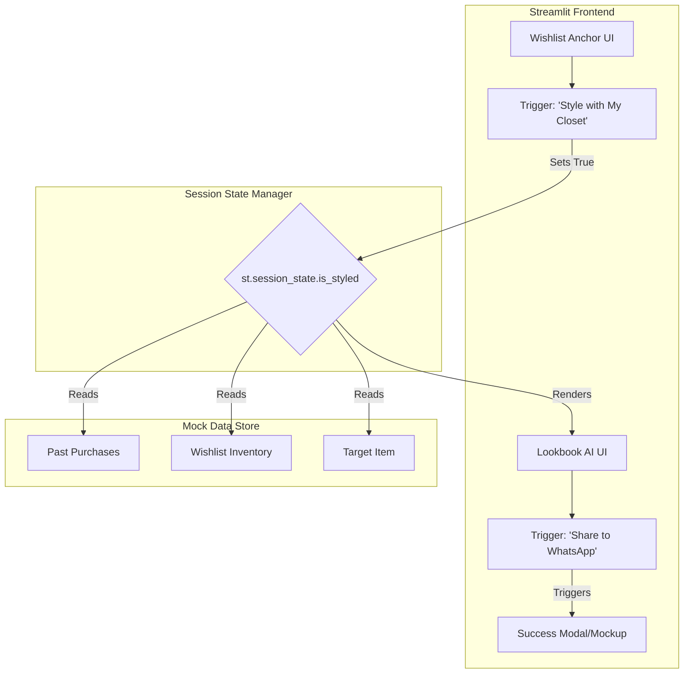

# Problem Statement: AI-Powered Smart Closet & Social Validation System (Myntra "StyleSync" Use Case)

You are tasked with building a high-fidelity "Wizard of Oz" UI prototype for a new e-commerce feature called **"StyleSync."** The system should intelligently resolve **"Styling Paralysis"** by visually pairing a user's wishlisted item with their past purchases, and prevent **"Off-Platform Leakage"** by natively integrating a WhatsApp social validation loop.

---

## Objective

Design and implement a single-page Streamlit application that:

1. **Displays a target wishlisted clothing item.**
2. **Simulates an AI backend ("Wizard of Oz" dummy data)** to generate complete outfits using the user's historical purchase data.
3. **Renders these outfits with clear psychological confidence tags** (e.g., `✅ In your closet`).
4. **Provides an interactive mock integration** for a WhatsApp "Buy or Drop" poll.
5. **Strictly manages UI state** so the application does not reset or lose generated outfits upon secondary button clicks.

---

# Architecture: Myntra "StyleSync" Prototype

This document describes the technical architecture for the Myntra-inspired StyleSync prototype. It defines components, state management flows, dummy data schemas, and implementation guidance for a Streamlit-based portfolio deliverable.

## Table of Contents

1. [Goals and Constraints](#1-goals-and-constraints)
2. [High-Level Architecture](#2-high-level-architecture)
3. [Logical Layers & Component Design](#3-logical-layers--component-design)
4. [Dummy Data Architecture (Wizard of Oz)](#4-dummy-data-architecture-wizard-of-oz)
5. [Request Lifecycle & State Management](#5-request-lifecycle--state-management)
6. [Presentation Layer & UI Flow](#6-presentation-layer--ui-flow)
7. [Cross-Cutting Concerns](#7-cross-cutting-concerns)

---

## 1. Goals and Constraints

### Primary Goals

| Goal | Description |
| :--- | :--- |
| **Styling Resolution** | Automatically generate modular outfits (Rule of 3) using a mix of the target item and the user's past purchases. |
| **Social Loop Closure** | Provide a seamless UX to trigger a WhatsApp poll, bringing social validation back to the app. |
| **Frictionless UX** | The UI must feel like a native app extension of the existing Myntra Wishlist. |
| **Resilient State** | The Streamlit app must not lose the AI-generated outfits when the user clicks the WhatsApp share button. |

### Architectural Constraints

* **Wizard of Oz Methodology:** Do NOT integrate real LLMs (OpenAI/Claude) or real databases. Hardcode all logic to ensure 100% reliability during the portfolio presentation.
* **Single-File Deployment:** The entire application must be contained within a single `app.py` file compatible with Streamlit Community Cloud.
* **No External Assets:** Do not use external image URLs that might break. Use Streamlit's native components, emojis, and typography to simulate the UI.

---

## 2. High-Level Architecture

The system follows a sequential UI state machine architecture.



---

## 3. Component Design & Logical Layers

### 3.1. Data Mocking Layer (Offline / Startup)
* **Responsibility:** Initialize the dummy datasets required to prove the product concept.
* Must load immediately on script execution.
* Must utilize standard Python dictionaries and lists.

### 3.2. The Anchor (Wishlist View)
* **Responsibility:** Establish the context of the app.
* Renders the Myntra header.
* Displays the isolated target item using `st.info` or a styled container.
* Houses the primary Call-to-Action (CTA): `"✨ Style with My Closet & Wishlist"`.

### 3.3. The Orchestrator (Simulated AI Engine)
* **Responsibility:** Handle the transition between the Anchor and the Lookbook.
* When the CTA is clicked, trigger `st.spinner("Analyzing your past purchases and wardrobe profile...")`.
* Force a `time.sleep(2)` to simulate API latency and build anticipation.
* Update the session state to lock the Lookbook UI in an "open" status.

### 3.4. Lookbook Presentation Layer
* **Responsibility:** Render the simulated AI outfits.
* Uses `st.columns` to layout Look 1 and Look 2 side-by-side or stacked cleanly.
* Applies distinct visual badges to items to trigger psychological relief (e.g., proving the user already owns the matching pants).

### 3.5. Social Integration Layer
* **Responsibility:** Render the WhatsApp share mechanism.
* Displays a secondary CTA: `"💬 Send Poll to WhatsApp"`.
* Upon click, fires `st.balloons()` and an `st.success()` banner.
* Displays an `st.caption` or `st.expander` simulating the WhatsApp chat interface preview.

---

## 4. Dummy Data Architecture (Wizard of Oz)

Define these exact dictionaries at the top of the `app.py` script:

### Target Wishlisted Item
```python
target_item = {
    "name": "Rust Linen Relaxed-Fit Blazer",
    "price": "₹3,499",
    "status": "Added 5 days ago",
    "icon": "🧥"
}
```

### User's Past Purchases
```python
past_purchases = [
    {"name": "Classic White Crewneck Tee", "badge": "✅ In your closet (Purchased Jan 2026)"},
    {"name": "High-Waisted Black Trousers", "badge": "✅ In your closet (Purchased Nov 2025)"}
]
```

### User's Other Wishlist Items
```python
wishlist_inventory = [
    {"name": "Gold Minimalist Watch", "badge": "💛 From your Wishlist"},
    {"name": "Light Wash Wide-Leg Denim", "badge": "💡 Suggested Pairing - ₹1,899"}
]
```

---

## 5. Request Lifecycle & State Management

> [!IMPORTANT]
> **Critical Implementation Detail for Streamlit:**  
> Because Streamlit reruns the entire script top-to-bottom on every button click, you must use `st.session_state` to persist the Lookbook state.

### Sequence Logic:
1. **Initialize State:** Check if `"is_styled"` exists in `st.session_state`. If not, initialize it to `False`.
2. **Render Anchor:** Display Section 1 (Anchor).
3. **Trigger Styling:** If `"Style with My Closet"` is clicked, set `st.session_state.is_styled = True`.
4. **Conditional Rendering:** Wrap Section 2 (Lookbook) and Section 3 (WhatsApp) inside an `if st.session_state.is_styled:` block.
5. **Secondary Interaction:** If `"Send Poll"` is clicked, execute success logic. Because `is_styled` is still `True`, the outfits remain persistent on the screen without resetting.

---

## 6. Presentation Layer & UI Flow

### Step 1: The Header
* **Title:** `🛍️ Myntra StyleSync`
* Divider line.

### Step 2: The Anchor Card
* Container displaying `target_item`.
* **Button:** `✨ Style with My Closet & Wishlist`

### Step 3: The Lookbook (Post-Click)
* **Success Banner:** *"We found 2 perfect outfits using clothes you already own!"*
* **Column 1 (Look 1: Smart Casual Office):**
  * *Layer:* Rust Linen Blazer (Current Item)
  * *Base:* Classic White Crewneck Tee `[✅ In your closet]`
  * *Bottoms:* High-Waisted Black Trousers `[✅ In your closet]`
* **Column 2 (Look 2: Weekend Brunch):**
  * *Layer:* Rust Linen Blazer (Current Item)
  * *Base:* White Ribbed Tank Top `[💡 Suggested Pairing]`
  * *Bottoms:* Light Wash Wide-Leg Denim `[💡 Suggested Pairing]`
  * *Accessory:* Gold Minimalist Watch `[💛 From your Wishlist]`

### Step 4: The Social Loop
* Divider line.
* **Subheader:** *"Can't decide? Ask your friends."*
* **Button:** `💬 Send Poll to WhatsApp`
* **On Click Event:**
  * Trigger `st.balloons()`
  * Show success message: *"Poll sent! We'll notify you when they vote."*
  * **Mockup render:** `"(Preview: Your friend receives an interactive card asking them to tap 'Buy Look 1' or 'Drop It'.)"`

---

## 7. Cross-Cutting Concerns

* **PEP8 Compliance:** Code must be cleanly formatted, modular, and highly readable.
* **Code Comments:** Explicit inline comments explaining the `st.session_state` logic so the Product Manager can present the technical architecture seamlessly during the portfolio review.
* **Dependencies:** Standard Python libraries only (`time`). External dependency required: `streamlit`.
