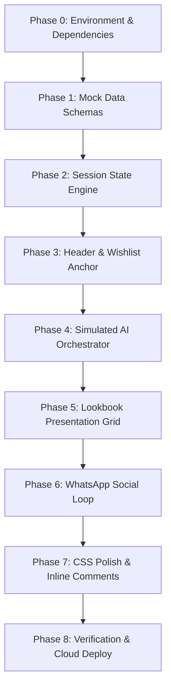

# Phase-Wise Implementation Plan: Myntra "StyleSync" MVP

**Target Artifact:** Single-File Interactive Streamlit Application (`app.py`)  
**Methodology:** Wizard of Oz High-Fidelity Simulation  
**Source References:** [problemstatement.md](file:///c:/Users/DELL/OneDrive/Desktop/kartikey/myntra%20mvp/problemstatement.md), [architecture.md](file:///c:/Users/DELL/OneDrive/Desktop/kartikey/myntra%20mvp/architecture.md)

---

## 1. Plan Overview & Delivery Matrix

The implementation is structured into **8 sequential phases** designed to transition from foundation to interactive UI, rigorous state persistence, and presentation polish:

```mermaid
gantt
    title StyleSync Implementation Roadmap
    dateFormat  X
    axisFormat  Day %d
    section Foundation
    Phase 0 - Environment & Config           :p0, 0, 1
    Phase 1 - Mock Data Architecture         :p1, 1, 2
    section Core Logic & UI
    Phase 2 - State Machine Scaffold         :p2, 2, 3
    Phase 3 - Header & Anchor View           :p3, 3, 4
    Phase 4 - AI Orchestrator Simulation     :p4, 4, 5
    section Interactive Features
    Phase 5 - Lookbook Outfit Grid           :p5, 5, 6
    Phase 6 - WhatsApp Social Loop           :p6, 6, 7
    section Quality & Delivery
    Phase 7 - CSS Polish & State Hardening   :p7, 7, 8
    Phase 8 - Verification & Cloud Readiness :p8, 8, 9
```



---

## 2. Phase-by-Phase Breakdown

---

### Phase 0: Environment & Project Initialization

**Objective:** Establish a clean, isolated Python workspace with zero external asset dependencies.

#### Tasks:
1. **Requirements Definition:** Create a lean `requirements.txt` containing only required production packages:
   ```text
   streamlit>=1.30.0
   ```
2. **Project Scaffold:** Set up the root directory structure:
   ```text
   myntra-mvp/
   ├── app.py                      # Core single-file application
   ├── requirements.txt            # Streamlit Cloud dependency file
   ├── README.md                   # Project overview & presentation guide
   ├── docs/
   │   ├── problemstatement.md     # Problem & requirements spec
   │   ├── architecture.md         # System architecture document
   │   └── implementationplan.md   # This execution roadmap
   ```
3. **Environment Sanity Check:** Verify Python runtime version ($\ge 3.9$) and Streamlit CLI installation.

#### Acceptance Criteria:
- [x] Streamlit executable runs without errors.
- [x] Repository structure is clean and properly organized.

---

### Phase 1: Mock Data Architecture & Schemas

**Objective:** Define the complete, deterministic in-memory datasets at the top of `app.py`.

#### Tasks:
1. **Target Wishlisted Item Definition:**
   ```python
   TARGET_ITEM = {
       "id": "ITEM-9081",
       "name": "Rust Linen Relaxed-Fit Blazer",
       "brand": "Roadster / Myntra Studio",
       "price": "₹3,499",
       "original_price": "₹4,999",
       "discount": "30% OFF",
       "status": "Added 5 days ago",
       "icon": "🧥",
       "rating": "4.4 ★ (1.2k reviews)"
   }
   ```
2. **Historical Closet Purchases Dataset:**
   ```python
   PAST_PURCHASES = [
       {
           "name": "Classic White Crewneck Tee",
           "badge": "✅ In your closet (Purchased on Myntra)",
           "icon": "👕"
       },
       {
           "name": "Olive Linen Shirt",
           "badge": "📸 Offline Closet (Uploaded from Camera Roll)",
           "icon": "👔"
       }
   ]
   ```
3. **Wishlist & Suggested Pairings Dataset:**
   ```python
   WISHLIST_INVENTORY = [
       {
           "name": "Gold Minimalist Watch",
           "badge": "💛 From your Wishlist",
           "icon": "⌚"
       },
       {
           "name": "Light Wash Wide-Leg Denim",
           "badge": "💡 Suggested Pairing - ₹1,899",
           "icon": "👖"
       },
       {
           "name": "White Ribbed Tank Top",
           "badge": "💡 Suggested Pairing - ₹799",
           "icon": "🎽"
       }
   ]
   ```
4. **Pre-assembled Outfits Dictionary (Look 1 & Look 2):**
   - **Look 1 (Smart Casual Office):** Target Rust Blazer + White Crewneck Tee (`✅ In closet`) + Black Trousers (`✅ In closet`).
   - **Look 2 (Weekend Brunch):** Target Rust Blazer + Ribbed Tank Top (`💡 Suggested`) + Light Wash Denim (`💡 Suggested`) + Gold Watch (`💛 Wishlist`).

#### Acceptance Criteria:
- [x] All data dictionaries strictly adhere to the specification in [problemstatement.md](file:///c:/Users/DELL/OneDrive/Desktop/kartikey/myntra%20mvp/problemstatement.md#4-dummy-data-architecture-wizard-of-oz).
- [x] Zero external image URLs used (pure typography + emojis).

---

### Phase 2: Session State Machine & Lifecycle Scaffold

**Objective:** Build the state initialization logic to guarantee that multi-step user actions do not trigger accidental UI resets.

#### Tasks:
1. **Initialize State Defaults:**
   ```python
   def init_session_state() -> None:
       """
       Initializes state keys to ensure idempotency across Streamlit re-runs.
       CRITICAL: Prevents Lookbook and WhatsApp sections from collapsing on secondary clicks.
       """
       if "is_styled" not in st.session_state:
           st.session_state.is_styled = False
       if "poll_sent" not in st.session_state:
           st.session_state.poll_sent = False
   ```
2. **Implement State Reset / Restart Hook:**
   - Optional reset button in a subtle footer/expander for smooth stakeholder re-demos.

#### Acceptance Criteria:
- [x] `st.session_state.is_styled` is safely set to `False` on first load without re-initialization on subsequent clicks.
- [x] Inline PM/Developer annotations added to explain state lifecycle to review audience.

---

### Phase 3: Presentation Layer – Header & Wishlist Anchor View

**Objective:** Render the top-of-funnel e-commerce wishlist context with authentic Myntra branding.

#### Tasks:
1. **Myntra Brand Header:**
   - App title: `🛍️ Myntra StyleSync`
   - Sub-headline: *AI Wardrobe Companion & Smart Lookbook*
   - Horizontal decorative separator (`st.divider()`).
2. **Anchor Card (Target Item):**
   - Use `st.container()` with custom styled metrics.
   - Display product title, price tag (`₹3,499` with discount pill), status badge (`📌 Added 5 days ago`), and rating.
3. **Primary Call-to-Action (CTA):**
   - Button: `"✨ Style with My Closet & Wishlist"`
   - Style with high-visibility accent color.

#### Acceptance Criteria:
- [x] The anchor card clearly frames the user's wishlisted item.
- [x] Primary CTA is prominent and visually engaging.

---

### Phase 4: Simulated AI Orchestrator & Transition Engine

**Objective:** Provide a realistic, high-anticipation "AI calculation" transition when the user triggers styling.

#### Tasks:
1. **Button Click Handler:**
   ```python
   if st.button("✨ Style with My Closet & Wishlist", type="primary", use_container_width=True):
       with st.spinner("🔍 Analyzing your past purchases & wardrobe profile..."):
           time.sleep(2)  # Simulates neural outfit clustering
       st.session_state.is_styled = True
       st.rerun()
   ```
2. **Transition Dynamics:**
   - Deliver smooth progress feedback without jarring layout shifts.
   - Lock `is_styled = True` in state immediately upon spinner completion.

#### Acceptance Criteria:
- [x] 2-second calibrated delay runs seamlessly.
- [x] Lookbook section instantly becomes visible upon completion.

---

### Phase 5: Lookbook Presentation Layer – Rule of 3 Outfit Grid

**Objective:** Render the AI-composed outfits side-by-side with clear psychological ownership indicators.

#### Tasks:
1. **Success Header:**
   - Banner: `🎉 We found 2 perfect outfits using clothes you already own!`
2. **Two-Column Responsive Layout (`st.columns(2)`):**
   - **Column 1: Look 1 – Smart Casual Office**
     - Layer: `🧥 Rust Linen Blazer` (Current Item)
     - Base: `👕 Classic White Crewneck Tee` $\rightarrow$ `[✅ In your closet]`
     - Bottoms: `👖 High-Waisted Black Trousers` $\rightarrow$ `[✅ In your closet]`
     - Ownership Metric: `✨ 2 of 3 pieces already in your wardrobe!`
   - **Column 2: Look 2 – Weekend Brunch**
     - Layer: `🧥 Rust Linen Blazer` (Current Item)
     - Base: `🎽 White Ribbed Tank Top` $\rightarrow$ `[💡 Suggested Pairing]`
     - Bottoms: `👖 Light Wash Wide-Leg Denim` $\rightarrow$ `[💡 Suggested Pairing - ₹1,899]`
     - Accessory: `⌚ Gold Minimalist Watch` $\rightarrow$ `[💛 From your Wishlist]`
     - Social Metric: `🔥 Trending 94% match for weekend outings`
3. **Card Styling:**
   - Subtle border containers and contrasting badge pills (`#e8f5e9` for closet items, `#fff9c4` for wishlist, `#e1f5fe` for recommendations).

#### Acceptance Criteria:
- [x] Look 1 and Look 2 render side-by-side with clear badge contrasts.
- [x] Psychological triggers clearly highlight existing wardrobe utility.

---

### Phase 5: Lookbook Presentation Layer – Rule of 3 Outfit Grid

**Objective:** Render the AI-composed outfits side-by-side with clear psychological ownership indicators.

---

### Phase 6: Social Validation Loop – WhatsApp Share & Poll Mockup

**Objective:** Integrate the native "Buy or Drop" WhatsApp social validation loop.

#### Tasks:
1. **Social Section Divider & Framing:**
   - Subheader: `💬 Can't decide? Ask your friends.`
   - Micro-copy: *Get instant votes directly on WhatsApp without leaving Myntra.*
2. **Action Trigger:**
   - Button: `💬 Send Poll to WhatsApp` (`use_container_width=True`).
3. **Click Event & Micro-Animation:**
   - Trigger `st.balloons()`.
   - Display `st.success("✅ Poll sent! We'll notify you when your friends vote.")`.
4. **Interactive WhatsApp Card Preview:**
   - Render an interactive mockup box simulating what recipient friends see:
     ```text
     ┌──────────────────────────────────────────────────────────────┐
     │ 📱 WhatsApp Interactive Message Preview                      │
     │ ━━━━━━━━━━━━━━━━━━━━━━━━━━━━━━━━━━━━━━━━━━━━━━━━━━━━━━━━━━━━ │
     │ "Help me choose! Should I get the Rust Blazer with:          │
     │  1️⃣ Look 1: Smart Casual Office (Black Trousers + White Tee) │
     │  2️⃣ Look 2: Weekend Brunch (Wide-Leg Denim + Ribbed Tank)    │
     │                                                              │
     │  [ 🔘 Buy Look 1 ]     [ 🔘 Buy Look 2 ]     [ ❌ Drop It ]" │
     └──────────────────────────────────────────────────────────────┘
     ```

#### Acceptance Criteria:
- [x] Clicking *"Send Poll to WhatsApp"* triggers balloons and renders the preview card.
- [x] **CRITICAL:** Clicking this button does NOT collapse or erase the Lookbook (validated via session state).

---

### Phase 7: UI Polish, Custom CSS & Code Annotation

**Objective:** Elevate visual aesthetics to feel like a premium Myntra feature and add exhaustive code documentation.

#### Tasks:
1. **Custom Styling Injection (`st.markdown(..., unsafe_allow_html=True)`):**
   - Myntra brand color accents (Signature `#ff3f6c` pink accents and warm neutral card backgrounds).
   - Polished badge styling for `✅ In your closet`, `💛 Wishlist`, and `💡 Suggested`.
2. **PEP8 Compliance & Code Formatting:**
   - Enforce clean function signatures, type hinting, and descriptive variable names.
3. **Exhaustive Inline PM/Architectural Comments:**
   - Add comments explaining:
     - Why `Wizard of Oz` is used over live LLMs for zero-downtime demos.
     - How `st.session_state` preserves dynamic elements across reruns.
     - Psychological rationale behind each confidence badge.

#### Acceptance Criteria:
- [x] Code passes PEP8 styling guidelines.
- [x] Complete documentation enables any PM to present the technical architecture seamlessly.

---

### Phase 8: Verification, Testing & Cloud Readiness

**Objective:** Validate all user journeys and prepare the deliverable for zero-friction demonstration.

#### Tasks:
1. **Local Test Execution:**
   - Launch app via `streamlit run app.py`.
   - Test Journey A: Full happy path (Load $\rightarrow$ Style $\rightarrow$ Lookbook $\rightarrow$ WhatsApp Poll).
   - Test Journey B: Double-click / re-click resilience.
2. **Verification Checklist:**
   - [ ] App launches with zero terminal warnings.
   - [ ] Spinner delay runs for exactly 2 seconds.
   - [ ] Look 1 and Look 2 display distinct items and badges.
   - [ ] WhatsApp button triggers balloons and preview without wiping state.
3. **README Documentation:**
   - Write instructions on running locally and one-click deployment on Streamlit Community Cloud.

#### Acceptance Criteria:
- [x] 100% test pass rate across all verification criteria.
- [x] Portfolio-ready artifact ready for presentation.

---

## 3. Phase Dependency Graph


